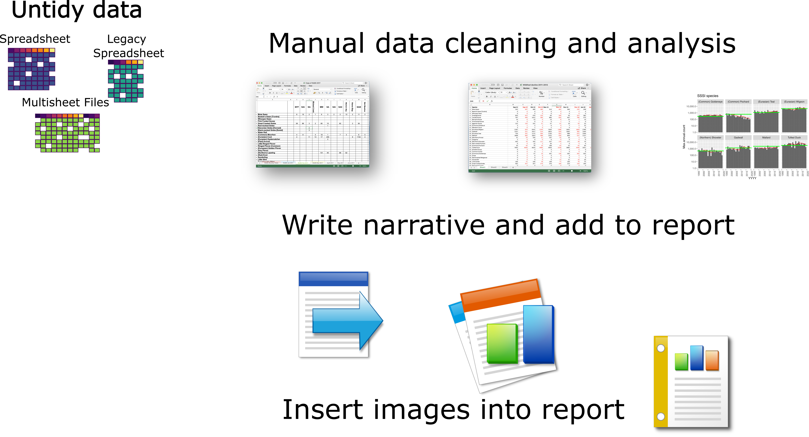

```{r setDefaults,  include=TRUE, echo=FALSE, warning=FALSE, message=FALSE, error=FALSE, results='asis'}
# Set code chunk options for all chunks
# These can be overridden at the chunk level, but setting global options 
# ensures consistency of chunk behaviour.
# To print a version of this document without code set echo = FALSE. 
#Include false will ignore the code chunk completely!
knitr::opts_chunk$set(include = TRUE, 
                      echo = TRUE, 
                      warning=FALSE, 
                      message=FALSE, 
                      error=FALSE, 
                     # fig.width = 3,
                    #  fig.height = 2,
                     # fig.width = 3,
                    out.width = '70%',
                      fig.align = "center",
                      results='asis')


```

# An Initial Analysis


-   You need to have a nominal description of the data, plus a nominal intention to plan the analysis.

-   This could be as simple as "Look for time related trends".

-   A descriptive analysis is a good place to start as this will also confirm that the data aligns with the nominal description.

# The manual way to analyse data



Multiple files multiple formats Multiple documents

# The Markdown Method


Single data source, Actions on data, Woven into report.
